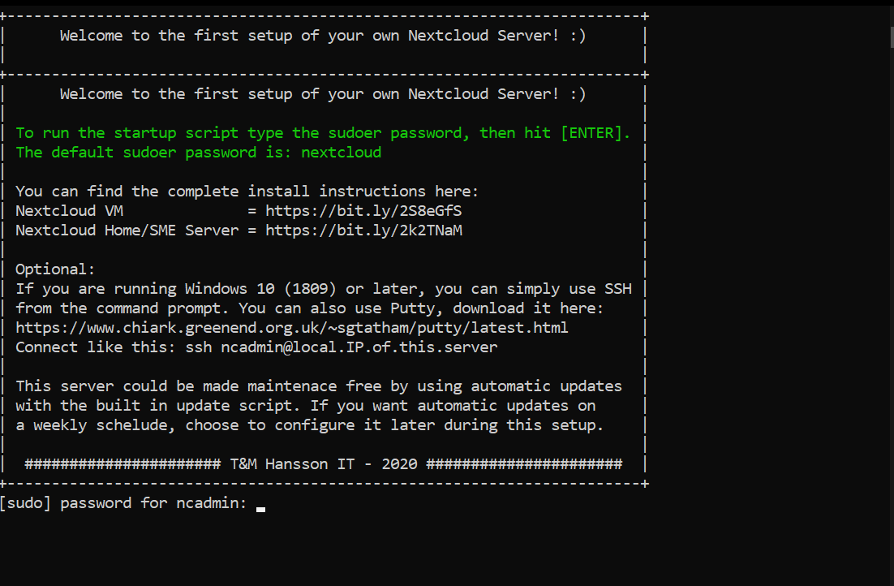
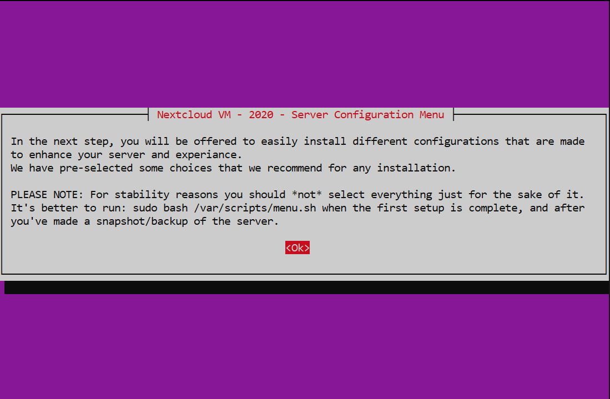
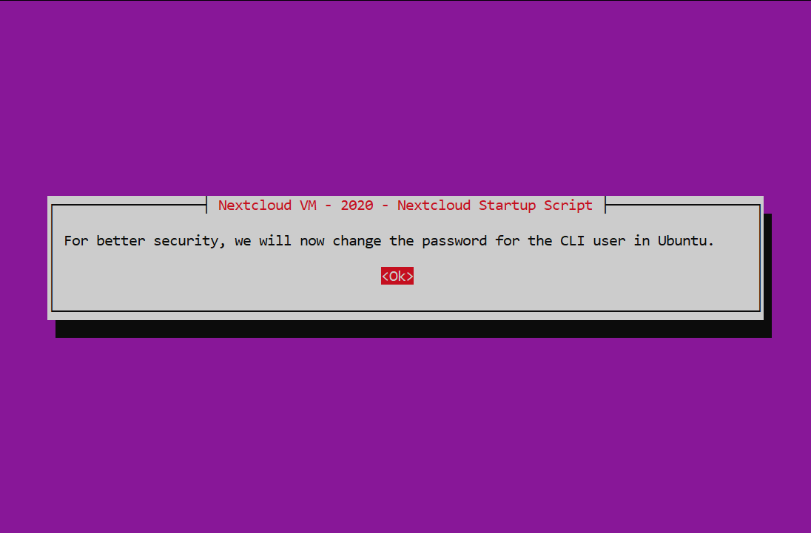
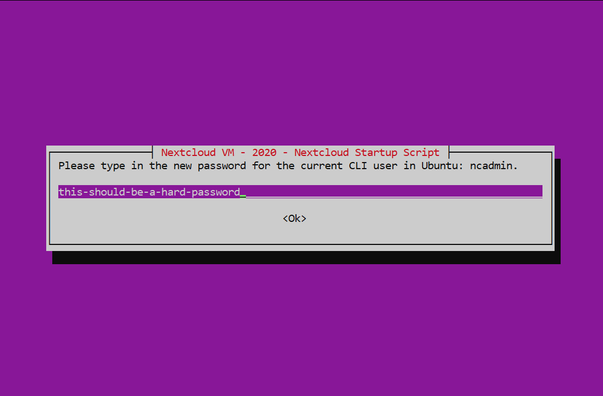
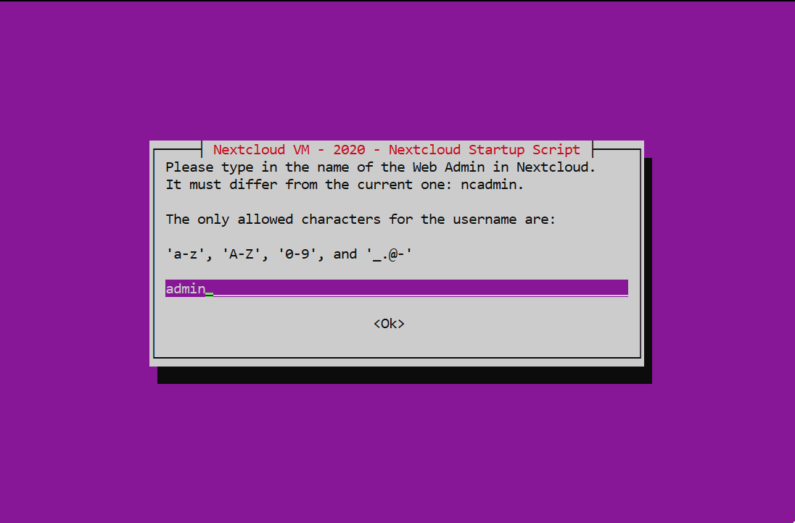
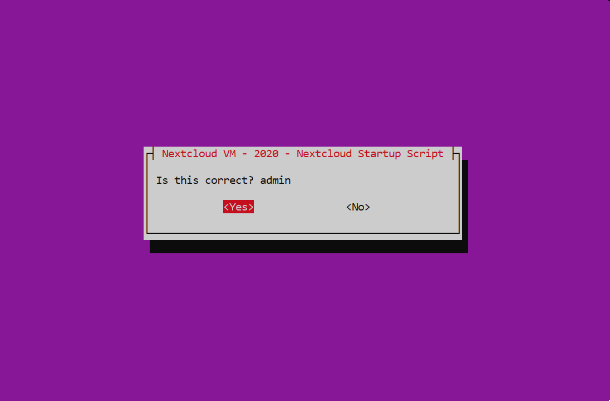
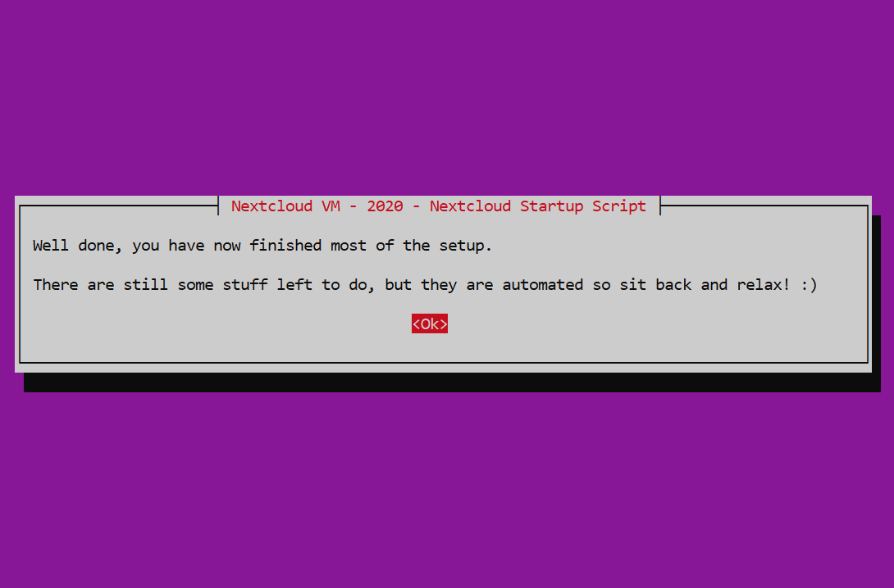
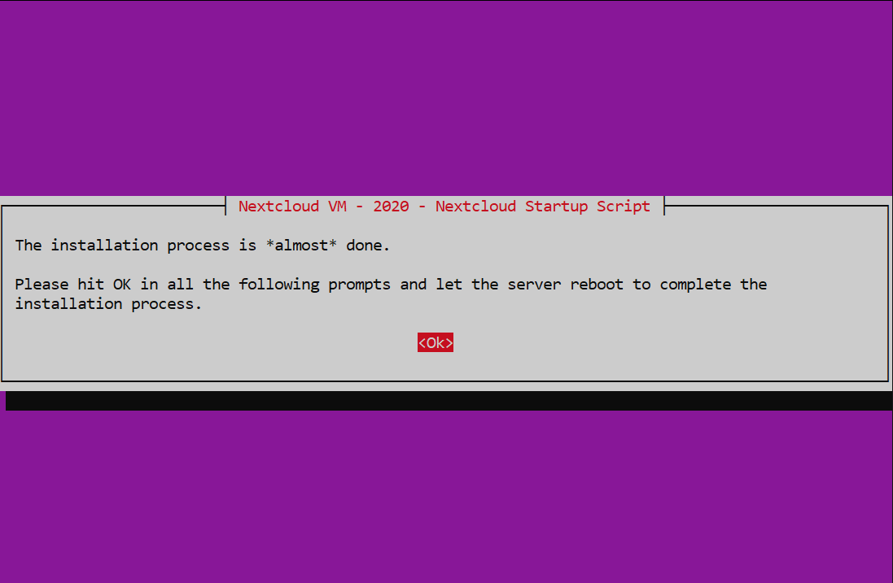

layout: true
class: center, middle

---

name: nextcloud-startup
# Nextcloud NAS Guide
# Nextcloud-Startup

---

layout: true
class: center, middle

Nextcloud NAS Guide - Nextcloud-Startup

---

.center[]
It will automatically ask for the password a second time so type it in.

---

.center[]
Press [ENTER] to continue

---

.center[]
Press [ENTER] to use the defaults

---

.center[]
Press [ENTER] to continue

---

.center[]
Press [ENTER] to continue

---

.center[]
Select your Geographic area and press [ENTER] to confirm

---

.center[]
Select your city or region and press [ENTER] to confirm

---

.center[]
Press [ENTER] to continue

---

.center[]
Press [ENTER] to continue

---

.center[]
Press [ENTER] to continue

---

.center[]
Press [ENTER] to continue

---

.center[]
Deselect everything and press [ENTER] to continue

---

.center[]
Press [ENTER] to continue

---

.center[]
Press [ENTER] to continue

---

.center[]
Deselect everything and press [ENTER] to continue

---

.center[]
Press [ENTER] to continue

---

.center[]
Type in a new password for your Ubuntu user. 
Press [ENTER] to confirm

---

.center[]
Press [ENTER] to confirm

---

.center[]
Press [ENTER] to continue

---

.center[]
Press [ENTER] to continue

---

.center[]
Type in the name of the Nextcloud admin account that will get newly created. 
E.g. "admin"

---

.center[]
Press [ENTER] to confirm

---

.center[]
Press [ENTER] to continue

---

.center[]
Press [ENTER] to continue

---

.center[]
Press [ENTER] to continue

---

.center[]
Press [ENTER] to continue

---

.center[]
Press [ENTER] to continue

---

.center[]
Press [ENTER] to reboot

---

### Please note: Since the server fingerprint was changed during this script, you will need to reset the server fingerprint the next time you connect to your server via SSH.

---

### The Nextcloud startup is now done.
### Please click [here](TODO) to continue where you left off.