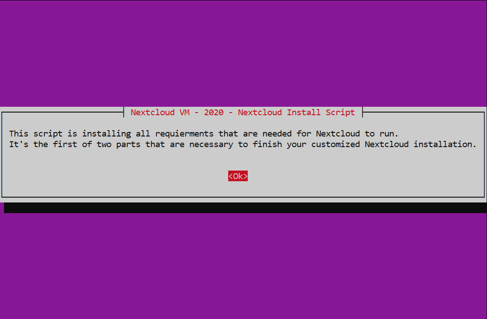
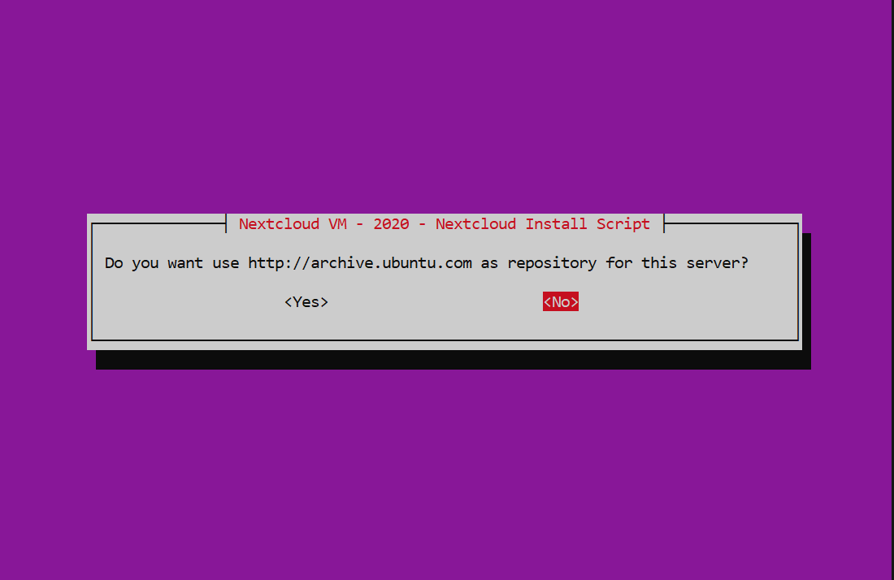
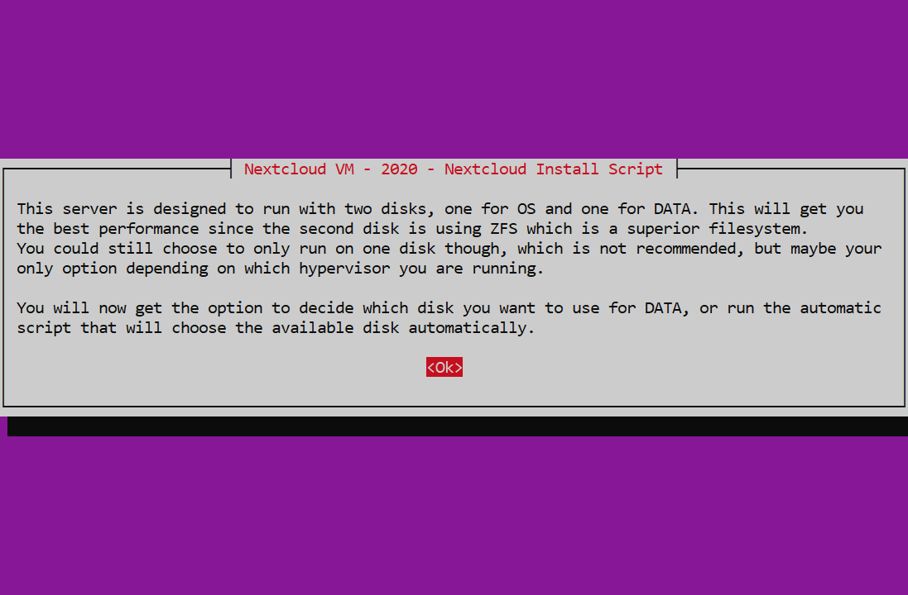
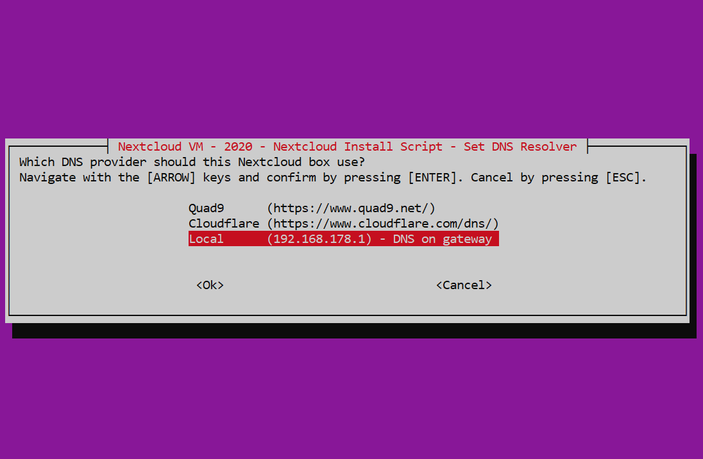
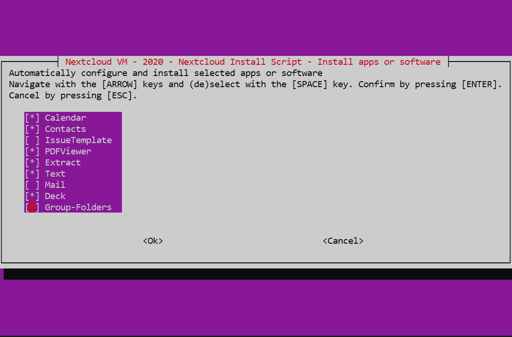

layout: true
class: center, middle

---

name: nextcloud-installation
# Nextcloud NAS Guide
# Nextcloud-Installation

---

layout: true
class: center, middle

Nextcloud NAS Guide - Nextcloud-Installation

---

.center[]
Press [ENTER] to continue

---

.center[]
Press [ENTER] to continue

---

.center[]
Select "No" and press [ENTER] to confirm

---

.center[]
Select "Yes" and press [ENTER] to confirm

---

.center[]
Press [ENTER] to continue

---

.center[]
Select "1 Disk" and press [ENTER] to confirm 
and wait until everything is installed

---

.center[]
Select "Local" and press [ENTER] to confirm 
and wait until everything is installed

---

.center[]
Select whatever you would like to install. 
Recommended are those who are selected here. 
Press [ENTER] to continue

---

.center[]
Press [ENTER] to reboot

---

### The Nextcloud installation is now done.
### Please click [here](../docs/nextcloud-startup) to continue with the guide.