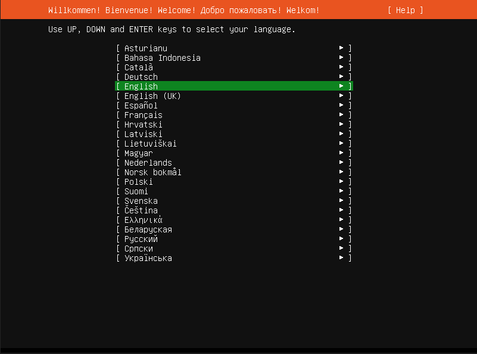
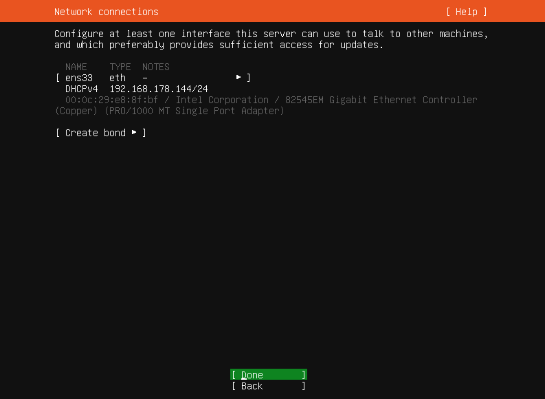
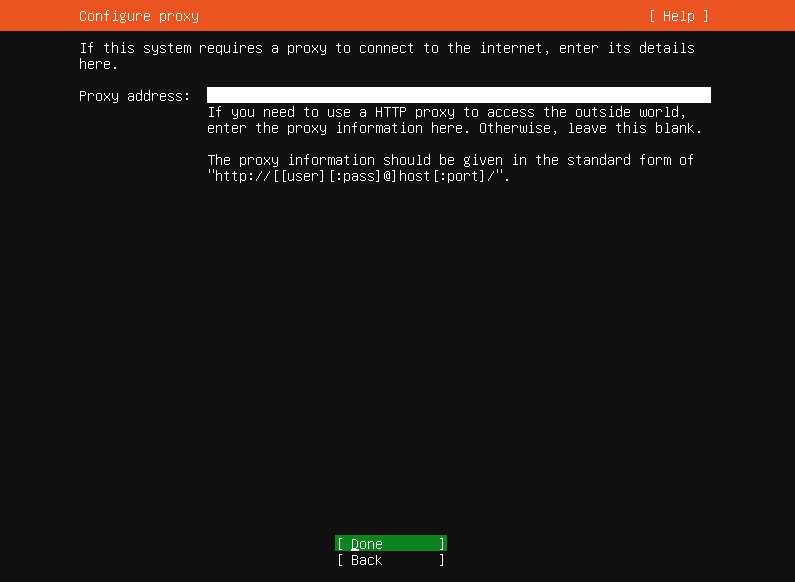
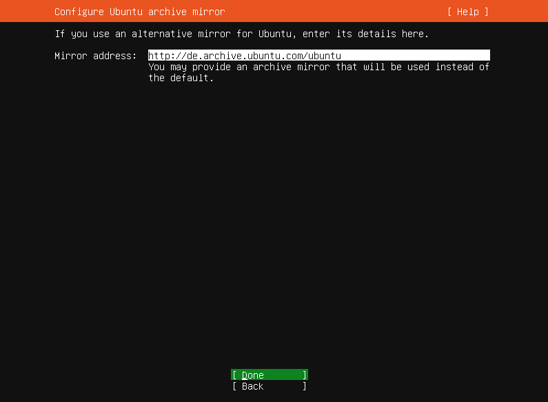
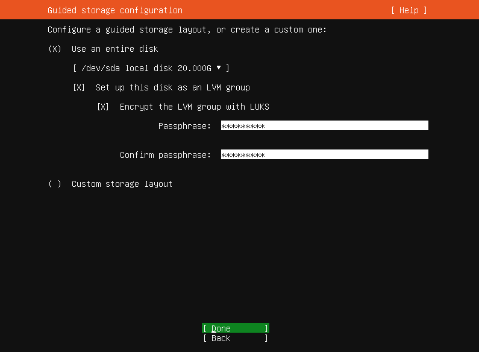
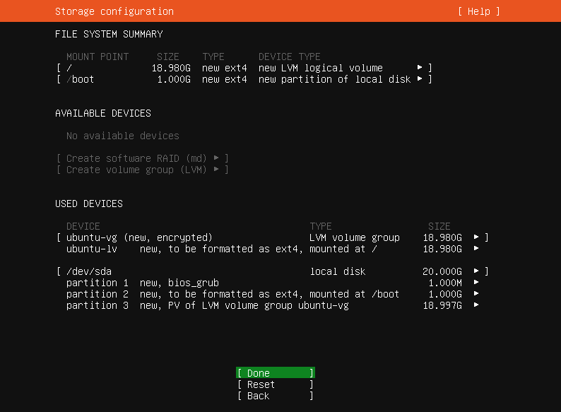
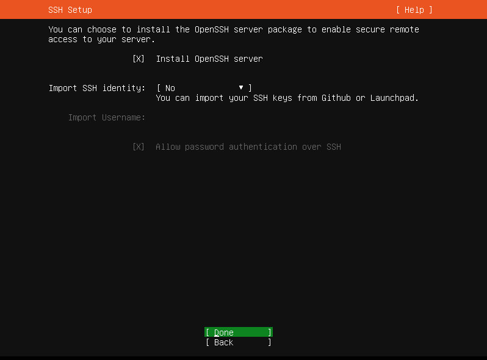
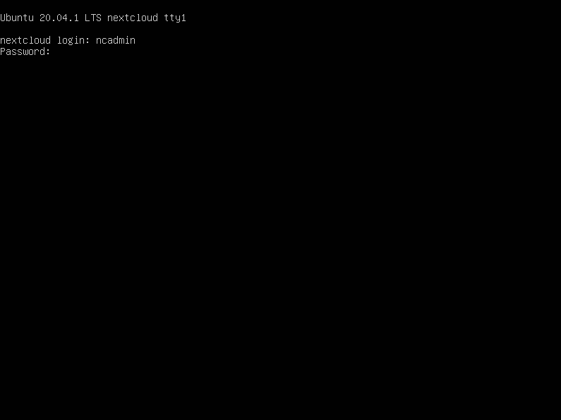

layout: true
class: center, middle

---

name: ubuntu
# Nextcloud NAS Guide
# Ubuntu

---

layout: true
class: center, middle

Nextcloud NAS Guide - Ubuntu

 

---

.center[]
Confirm the default "Try or install Ubuntu Server" by pressing [ENTER]

---

.center[]
Select the correct language with the [ARROW] keys. 
Confirm by pressing [ENTER]

---

.center[]
Choose the correct keyboard layout with the [ARROW] and [ENTER] keys. 
Confirm by selecting "Done" and pressing [ENTER]

---

.center[]
Confirm the default "Ubuntu Server" by selecting "Done" and pressing [ENTER]

---

When asked for Ubuntu Pro, select "Skip for now" and press [ENTER].

---

.center[]
Press [ENTER] to use the default settings

---

.center[]
Press [ENTER] to use the default settings

---

.center[]
Press [ENTER] to use the default settings

---

name: luks
.center[]
Activate "Encrypt the LVM group with LUKS" and type in a difficult passphrase. 
Afterwards confirm by selecting "Done" and pressing [ENTER]

---

Please note: The installer doesn't check if the passphrases are equal!

Also, because of a bug in Ubuntu, you should only use characters for that passphrase that are the same on QWERTY keyboard layouts! You can find a example of a QWERTY layout here: [click here](https://en.wikipedia.org/wiki/QWERTY#/media/File:KB_United_States.svg) 
Additionally, please make sure, that `Capslock` isn't activated.

---

.center[]
Press [ENTER] to confirm the settings

---

.center[]
Select "Continue" and press [ENTER] to confirm the settings

---

name: profile
.center[]
Type in the values like shown here. As password is "nextcloud" for now good enough.
Please note: The installer doesn't check if the passwords are equal!

---

.center[]
Activate "Install OpenSSH server", select "Done" and press [ENTER]

---

.center[]
Select "Done" and press [ENTER]

---

.center[]
Wait until everything was installed. 
Afterwards select "Reboot" and press [ENTER] to continue.

---

### Please remove the Ubuntu USB-stick now if not already done.
### Otherwise the system will not reboot.
### It is possible that you must press [ENTER] to continue.

---

.center[]
During the boot process, type in your [LUKS passphrase](#luks) and press [ENTER] to confirm. 
(If you experience trouble, please have a look at the next page.)

---

If it doesn't accept your [LUKS passphrase](#luks) and you are sure that you enterd it correctly, most likely you experienced an Ubuntu bug. In this case, try to enter your password as if you had an `QWERTY` keyboard. Here is one example [click here](https://en.wikipedia.org/wiki/QWERTY#/media/File:KB_United_States.svg).

---

.center[]
Type in your [username and password](#profile)

---

.center[]
Here you can see the IPv4-address which you will need in the next step.

---

### The Ubuntu installation is now done.
### Please click [here](../docs/ssh) to continue with the guide.